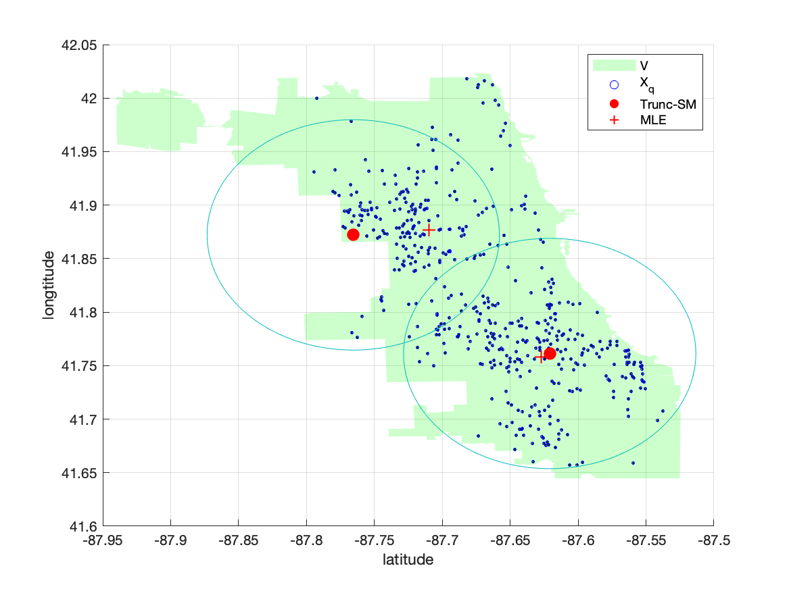
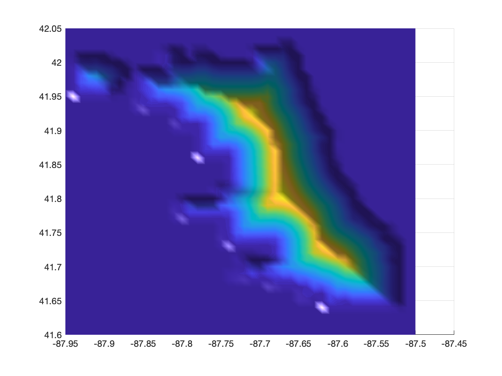

# Truncated-Score-Matching
Code for https://arxiv.org/abs/1910.03834

This code uses Alejandro Weinstein's Distance from a point to polygon MATLAB code: 

https://www.mathworks.com/matlabcentral/fileexchange/19398-distance-from-a-point-to-polygon

This code also requires MATLAB's symbolic toolbox and can be accelerated if parallel computing toolbox is available. 

## How to run
```bash
cd script
matlab -nodesktop -r 'demoChi'
```

You should see


